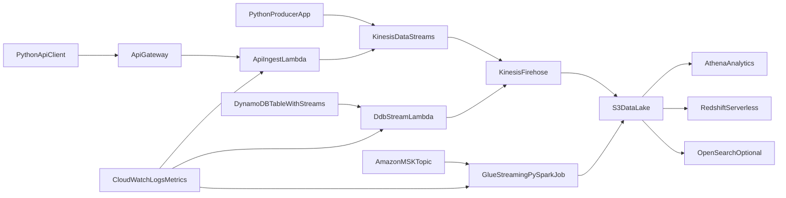

# AWS Streaming Pipeline Learning Guide

This project helps you learn how to build an end-to-end AWS streaming pipeline using:
- Python for event producers, API clients, and Lambda-oriented logic
- PySpark (AWS Glue Streaming) for streaming ETL transformations
- Simple Infrastructure as Code (CloudFormation) with CI deployment using GitHub Actions

By the end, you will run a working pipeline from multiple sources to analytics targets.

Full tutorial: [tutorials/aws-streaming-pipelines-python-pyspark.md](tutorials/aws-streaming-pipelines-python-pyspark.md)
Structured labs: [labs/README.md](labs/README.md)

Git tutorials:
- [tutorials/git-basics-for-data-engineers.md](tutorials/git-basics-for-data-engineers.md)
- [tutorials/github-actions-and-pr-workflow.md](tutorials/github-actions-and-pr-workflow.md)

## What You Will Build

A multi-source streaming architecture with:
- Source 1: Python producer -> Amazon Kinesis Data Streams
- Source 2: API source (API Gateway + Lambda) -> Kinesis
- Source 3: DynamoDB Streams (CDC) -> Lambda -> Firehose
- Source 4: Amazon MSK -> Glue Streaming (PySpark)
- Targets: Amazon S3, Athena, Redshift Serverless (and optional OpenSearch)

## Python and PySpark Coverage

- Python is used for:
  - Streaming event producer scripts
  - API load generator/client
  - Lambda event normalization examples
- PySpark is used for:
  - Glue Structured Streaming job
  - JSON parsing and schema enforcement
  - Deduplication with event keys and watermarking
  - Curated Parquet writes to S3 with checkpoints

## Visual Data Flow

## Learning Path (Labs)

1. Foundation and architecture
2. IaC bootstrap with simple CloudFormation
3. CI deployment with GitHub Actions
4. Python source ingestion
5. API source ingestion
6. PySpark streaming transformation
7. CDC source integration
8. Target loading and analytics with Athena/Redshift
9. Observability, reliability, and security hardening
10. Final validation of end-to-end working pipeline

## Starter Assets Included

- IaC template: `infra/streaming-stack.yml`
- CI workflow: `.github/workflows/deploy-streaming-stack.yml`
- Python producers: `src/producers/`
- Lambda handlers: `lambdas/`
- PySpark Glue job: `jobs/glue/streaming_etl.py`
- Structured lab docs: `labs/`

## Recommended Preparation

Before starting Lab 1, complete:
1. Git basics tutorial
2. GitHub Actions and PR workflow tutorial

## Expected Outcome

After completing the labs, you will be able to:
- Deploy the pipeline stack via CI
- Stream data from multiple real-world source patterns
- Transform and curate data in PySpark
- Query near real-time results in Athena and Redshift
- Operate the pipeline with basic reliability and monitoring practices
