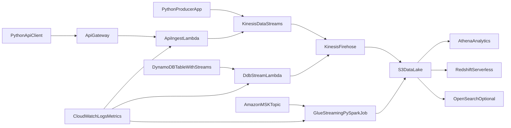

# AWS Streaming Pipelines on AWS (Python + PySpark + Simple IaC)

This tutorial teaches how to build an end-to-end data streaming pipeline on AWS using Python and PySpark, with CloudFormation for IaC and GitHub Actions for CI deployment.

Repository starter assets are included, so you can run labs directly:
- `infra/streaming-stack.yml`
- `.github/workflows/deploy-streaming-stack.yml`
- `src/producers/`
- `lambdas/`
- `jobs/glue/streaming_etl.py`
- `labs/README.md` (structured lab track)

## 1) Learning Goals

By the end of this tutorial, you will be able to:
- Build a multi-source streaming pipeline on AWS.
- Use Python for event production, API-based ingestion, and Lambda normalization.
- Use PySpark (AWS Glue Streaming) for schema-aware stream transformation.
- Land streaming data in S3 and query in Athena and Redshift.
- Deploy infrastructure through CI using GitHub Actions and CloudFormation.

## 2) Architecture and Data Flow



## 3) Services Used and Why

- Amazon Kinesis Data Streams: low-latency stream ingestion.
- Amazon API Gateway + Lambda: API source that converts HTTP events to stream records.
- Amazon DynamoDB Streams: CDC source from table changes.
- Amazon MSK: Kafka-compatible source for enterprise-style streams.
- AWS Glue Streaming (PySpark): transformation, deduplication, and curated writes.
- Kinesis Firehose: managed delivery to S3.
- Amazon S3: durable data lake storage (raw + curated).
- Athena: serverless SQL analytics directly on S3.
- Redshift Serverless: near real-time warehouse analytics.
- CloudWatch: logs, metrics, alarms.
- IAM + KMS + Secrets Manager: secure operations.

## 4) Prerequisites

- AWS account with permissions for Kinesis, Lambda, API Gateway, Glue, S3, Firehose, IAM, Athena, Redshift, CloudWatch.
- Python 3.10+ and `pip`.
- AWS CLI configured (`aws configure`).
- GitHub repository and GitHub Actions enabled.
- Optional: local Spark for testing (not required if using Glue only).

## 5) Lab 1: CloudFormation IaC Bootstrap (Simple)

Create a stack with core resources: Kinesis stream, S3 bucket, Firehose delivery stream, IAM roles, and a basic Lambda for API ingestion.

### Minimal CloudFormation skeleton

```yaml
AWSTemplateFormatVersion: "2010-09-09"
Description: Streaming pipeline base stack
Resources:
  RawBucket:
    Type: AWS::S3::Bucket
    Properties:
      BucketEncryption:
        ServerSideEncryptionConfiguration:
          - ServerSideEncryptionByDefault:
              SSEAlgorithm: AES256

  EventStream:
    Type: AWS::Kinesis::Stream
    Properties:
      ShardCount: 1
      RetentionPeriodHours: 24

Outputs:
  BucketName:
    Value: !Ref RawBucket
  KinesisStreamName:
    Value: !Ref EventStream
```

Deploy manually once (for local understanding):

```bash
aws cloudformation deploy \
  --template-file infra/streaming-stack.yml \
  --stack-name streaming-pipeline-dev \
  --capabilities CAPABILITY_NAMED_IAM
```

## 6) Lab 2: CI Deployment with GitHub Actions

Goal: user learns CI by deploying/updating the CloudFormation stack through a workflow.

### Example workflow

```yaml
name: Deploy Streaming Stack
on:
  workflow_dispatch:
  push:
    branches: [ "main" ]
    paths:
      - "infra/**"

permissions:
  id-token: write
  contents: read

jobs:
  deploy:
    runs-on: ubuntu-latest
    steps:
      - uses: actions/checkout@v4
      - name: Configure AWS credentials (OIDC)
        uses: aws-actions/configure-aws-credentials@v4
        with:
          role-to-assume: ${{ secrets.AWS_ROLE_TO_ASSUME }}
          aws-region: ${{ secrets.AWS_REGION }}
      - name: Validate CloudFormation
        run: aws cloudformation validate-template --template-body file://infra/streaming-stack.yml
      - name: Deploy stack
        run: |
          aws cloudformation deploy \
            --template-file infra/streaming-stack.yml \
            --stack-name streaming-pipeline-dev \
            --capabilities CAPABILITY_NAMED_IAM
      - name: Show outputs
        run: aws cloudformation describe-stacks --stack-name streaming-pipeline-dev --query "Stacks[0].Outputs"
```

## 7) Lab 3: Source 1 - Python Producer to Kinesis

Install dependencies:

```bash
pip install boto3
```

Producer example:

```python
import json
import time
import uuid
from datetime import datetime, timezone
import boto3

STREAM_NAME = "your-kinesis-stream"
client = boto3.client("kinesis", region_name="us-east-1")

while True:
    event = {
        "event_id": str(uuid.uuid4()),
        "source": "python_producer",
        "event_ts": datetime.now(timezone.utc).isoformat(),
        "user_id": f"user-{uuid.uuid4().hex[:6]}",
        "amount": 10.5,
        "schema_version": 1,
    }
    client.put_record(
        StreamName=STREAM_NAME,
        Data=json.dumps(event).encode("utf-8"),
        PartitionKey=event["user_id"],
    )
    time.sleep(1)
```

## 8) Lab 4: Source 2 - API Source (API Gateway + Lambda)

Use API Gateway to accept JSON events and push to Kinesis through Lambda.

Lambda handler (Python):

```python
import json
import os
import uuid
from datetime import datetime, timezone
import boto3

kinesis = boto3.client("kinesis")
STREAM_NAME = os.environ["STREAM_NAME"]

def handler(event, context):
    body = json.loads(event.get("body", "{}"))
    payload = {
        "event_id": str(uuid.uuid4()),
        "source": "api_gateway",
        "event_ts": datetime.now(timezone.utc).isoformat(),
        "schema_version": 1,
        "payload": body,
    }
    kinesis.put_record(
        StreamName=STREAM_NAME,
        Data=json.dumps(payload).encode("utf-8"),
        PartitionKey="api-source",
    )
    return {"statusCode": 200, "body": json.dumps({"ok": True})}
```

## 9) Lab 5: Source 3 - DynamoDB Streams (CDC)

- Enable streams on a DynamoDB table (`NEW_AND_OLD_IMAGES`).
- Add Lambda trigger from DynamoDB Stream ARN.
- In Lambda, map CDC records to normalized event schema and write to Firehose or Kinesis.

## 10) Lab 6: Source 4 - MSK + PySpark Transformation (Glue)

PySpark structured streaming example (Glue job script):

```python
from pyspark.sql import functions as F
from pyspark.sql.types import StructType, StructField, StringType, DoubleType, IntegerType

schema = StructType([
    StructField("event_id", StringType(), True),
    StructField("source", StringType(), True),
    StructField("event_ts", StringType(), True),
    StructField("user_id", StringType(), True),
    StructField("amount", DoubleType(), True),
    StructField("schema_version", IntegerType(), True),
])

raw_df = spark.readStream.format("kafka") \
    .option("kafka.bootstrap.servers", "b-1.msk:9092") \
    .option("subscribe", "events") \
    .load()

parsed = raw_df.select(F.from_json(F.col("value").cast("string"), schema).alias("r")).select("r.*")

clean = parsed \
    .withWatermark("event_ts", "10 minutes") \
    .dropDuplicates(["event_id"])

clean.writeStream \
    .format("parquet") \
    .option("path", "s3://your-curated-bucket/curated/events/") \
    .option("checkpointLocation", "s3://your-curated-bucket/checkpoints/events/") \
    .outputMode("append") \
    .start()
```

## 11) Lab 7: Target Analytics in S3, Athena, and Redshift

### Athena table example

```sql
CREATE EXTERNAL TABLE IF NOT EXISTS curated_events (
  event_id string,
  source string,
  event_ts string,
  user_id string,
  amount double,
  schema_version int
)
STORED AS PARQUET
LOCATION 's3://your-curated-bucket/curated/events/';
```

Validation query:

```sql
SELECT source, count(*) AS events
FROM curated_events
GROUP BY source
ORDER BY events DESC;
```

For Redshift Serverless, use `COPY` or federated ingestion pattern from curated S3 paths.

## 12) Lab 8: Observability and Reliability

- CloudWatch dashboards: ingestion throughput, Lambda errors, Glue job lag.
- Alarms: Lambda error > threshold, Firehose delivery failures, Glue streaming failures.
- Reliability patterns:
  - idempotency key = `event_id`
  - DLQ for failed records
  - replay approach from S3 raw zone

## 13) Final Validation Checklist

- CI workflow deploys CloudFormation stack successfully.
- Python producer writes events continuously.
- API source receives and forwards events.
- CDC events from DynamoDB are captured.
- PySpark job writes curated parquet to S3.
- Athena query returns multi-source data.
- Redshift reflects expected aggregates.

## 14) Cleanup

```bash
aws cloudformation delete-stack --stack-name streaming-pipeline-dev
```

Also remove Glue jobs, Athena tables/databases, and Redshift resources if created outside the stack.

## 15) Next Improvements

- Add data contracts and schema registry.
- Add Great Expectations data quality checks.
- Add blue/green deployment for streaming jobs.
- Add cost dashboards and budget alarms.
